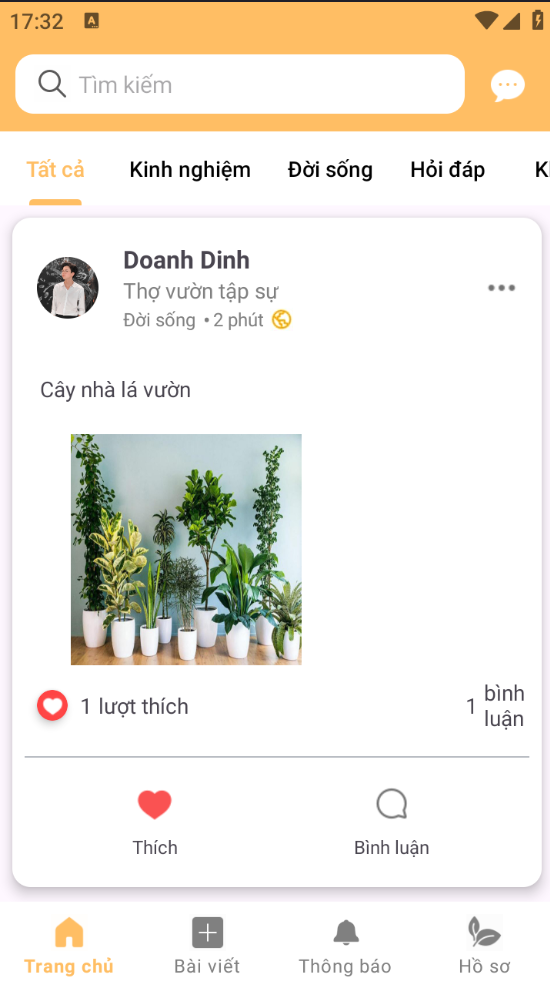
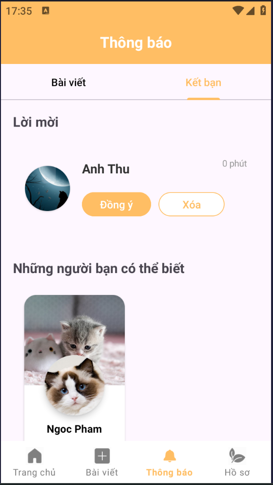

# social-media-micro-project

[](https://opensource.org/licenses/MIT)

## Mô tả

Dự án **social-media-micro-project** là một mạng xã hội mini, nơi người dùng có thể kết nối, chia sẻ, trò chuyện và tương tác với nhau. Dự án hướng tới việc thực hành teamwork, phát triển ứng dụng thực tế, áp dụng các công nghệ hiện đại cả Backend lẫn Mobile.

## Tính năng chính
- Đăng ký, đăng nhập, xác thực người dùng
- Cập nhật thông tin cá nhân, ảnh đại diện, ảnh bìa
- Gửi, nhận, huỷ, phản hồi lời mời kết bạn
- Danh sách bạn bè, huỷ kết bạn
- Đăng bài viết, bình luận, thích bài viết
- Nhắn tin, trò chuyện với bạn bè
- Đề xuất kết bạn, tìm kiếm người dùng, tìm kiếm cuộc trò chuyện
- Nhận thông báo khi có tương tác mới

## Screenshot
<table width="100%">
  <tbody>
    <tr>
      <td width="1%"></td>
      <td width="1%"></td>
      <td width="1%"></td>
      <td width="1%"></td>
    </tr>
    <tr>
       <td width="1%"></td>
       <td width="1%"></td>
       <td width="1%"></td>
       <td width="1%"></td>
    </tr>
  </tbody>
</table> 
<table>
  <tbody>
    <tr>
       <td width="1%"></td>
       <td width="1%"></td>
       <td width="1%"></td>
       <td width="2%"></td>
    </tr>
  </tbody>
</table> 

## Thành viên nhóm
- **Đinh Sỹ Quốc Doanh** (Leader project, Backend)
- **Nguyễn Anh Tú** (Database)
- **Trần Tấn Quân** (Database)
- **Lê Hoàng Anh Thư** (Frontend Mobile)
- **Phạm Thị Hoài Ngọc** (Frontend Mobile)

## Công nghệ sử dụng
- **Backend:** Python, FastAPI, SQLAlchemy, Cloudinary, Websocket
- **Database:** SQL Server
- **Frontend Mobile:** Android (Java/Kotlin)
- **Khác:** Cloudinary (lưu trữ ảnh), JWT (xác thực), CORS, v.v.

## Cách cài đặt
1. Clone repository:
```bash
git clone <link.git>
```
### Database
1. Cài đặt cơ sở dữ liệu
```bash
cd database
```
Import file `database/CreateDB.sql` vào SQL Server để tạo database và các bảng cần thiết.

### Backend
1. Cài đặt Python >= 3.8
```bash
cd backend
```
2. Tạo môi trường ảo
```bash
# Windows
python -m venv venv
venv\Scripts\activate

# Linux/Mac
python3 -m venv venv
source venv/bin/activate
```
3. Cài đặt thư viện:
```bash
pip install -r backend/requirements.txt --no-cache-dir
```
1. Cấu hình file `.env`
```bash
DB_USER=        # Thay bằng thông tin của bạn
DB_PASSWORD=    # Thay bằng thông tin của bạn
DB_SERVER=      # Thay bằng thông tin của bạn
DB_NAME=SocialNetworkDB

SECRET_KEY=     # Thay bằng thông tin của bạn
ALGORITHM=      # Thay bằng thông tin của bạn
ACCESS_TOKEN_EXPIRE_MINUTES=30
REFRESH_TOKEN_EXPIRE_DAYS=7

UPLOAD_FOLDER=uploads

CLOUDINARY_CLOUD_NAME=  # Thay bằng thông tin của bạn
CLOUDINARY_API_KEY=     # Thay bằng thông tin của bạn
CLOUDINARY_API_SECRET=  # Thay bằng thông tin của bạn
```
2. Chạy server phát triển:
```bash
uvicorn app.main:app --reload
```
3. Kết nối API local:
```bash
uvicorn app.main:app --host 0.0.0.0 --port 8000
```

### Frontend
- Mở thư mục `frontend/app` bằng Android Studio.
- Sync Gradle và build project.
- Chạy ứng dụng trên thiết bị/emulator Android.

## Cách sử dụng
- Đăng ký tài khoản, đăng nhập.
- Kết bạn, gửi/nhận/huỷ lời mời kết bạn.
- Đăng bài viết, bình luận, thích bài viết.
- Nhắn tin với bạn bè.
- Xem thông báo tương tác.

## Cấu trúc dự án
```
├── backend/
│   ├── app/
│   │   ├── controllers/   # Xử lý logic nghiệp vụ
│   │   ├── routers/       # Định nghĩa các API endpoint
│   │   ├── models/        # Định nghĩa các model ORM
│   │   ├── schemas/       # Định nghĩa các schema (Pydantic)
│   │   ├── utils/         # Tiện ích, hàm dùng chung (cloudinary, bảo mật...)
│   │   ├── config/        # Cấu hình database, settings
│   │   ├── middleware/    # Middleware (JWT, xác thực...)
│   │   └── main.py        # Điểm khởi động FastAPI
│   ├── requirements.txt   # Thư viện backend
│   └── uploads/           # Lưu file upload tạm thời (nếu có)
├── frontend/              # Source code mobile app (Android)
├── database/              # Script tạo database, migration
├── LICENSE                # Giấy phép MIT
└── README.md              # Tài liệu dự án
```

## Đóng góp
<p align="center">
  <a href="https://github.com/Doanh-Dinh-7">
    
  </a>
  <a href="https://github.com/LHAnhThu">
    
  </a>
  <a href="https://github.com/PhamThiHoaiNgoc">
    
  </a>
  <a href="https://github.com/anhtu16">
    
  </a>
</p>

Chúng tôi rất hoan nghênh mọi đóng góp từ cộng đồng. Nếu bạn muốn đóng góp, vui lòng:

1. Fork repository
2. Tạo branch mới (`git checkout -b feature/AmazingFeature`)
3. Commit thay đổi (`git commit -m 'Add some AmazingFeature'`)
4. Push lên branch (`git push origin feature/AmazingFeature`)
5. Tạo Pull Request

## Giấy phép

Dự án được phát hành theo giấy phép [MIT License](./LICENSE).

---


Nếu có thắc mắc hoặc đóng góp, vui lòng liên hệ thành viên nhóm qua [email](dinhsyquocdoanh@gmail.com) hoặc [github](https//github.com/Doanh-Dinh-7).
